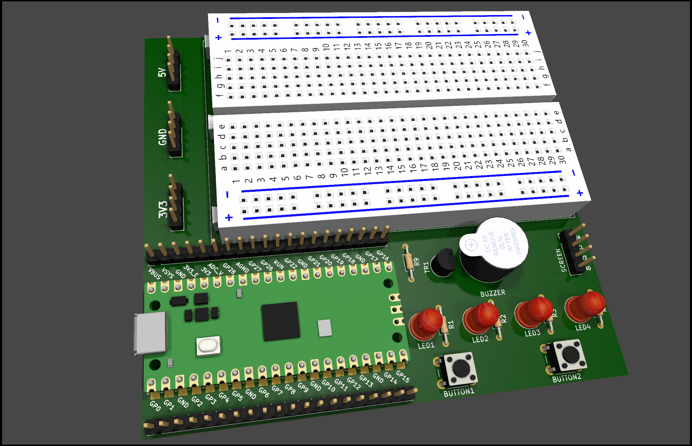

# Pico Breadboard Kit

This is a simple Raspberry Pi Pico breadboard kit designed for students to learn and experiment with basic electronics and microcontroller programming.

## Features

- **Raspberry Pi Pico** with full GPIO breakout
- **Two tactile buttons** connected to GPIOs
- **Four LEDs** with current-limiting resistors
- **Buzzer** controlled via transistor switch
- **Headers for external 3.3V and 5V power**
- **Dedicated I2C connector for screen (SCL/SDA)**
- All components are laid out to be easily accessible on a standard breadboard.

## Getting Started

1. Insert the Raspberry Pi Pico into the breadboard.
2. Connect power via USB.
3. Upload your code using Thonny or the Pico SDK.
4. Use the built-in components (buttons, LEDs, buzzer) to test your logic.

## Schematic

See the included `schematic.pdf` for the detailed wiring.

---

This kit is ideal for beginner-level microcontroller projects and educational settings.
